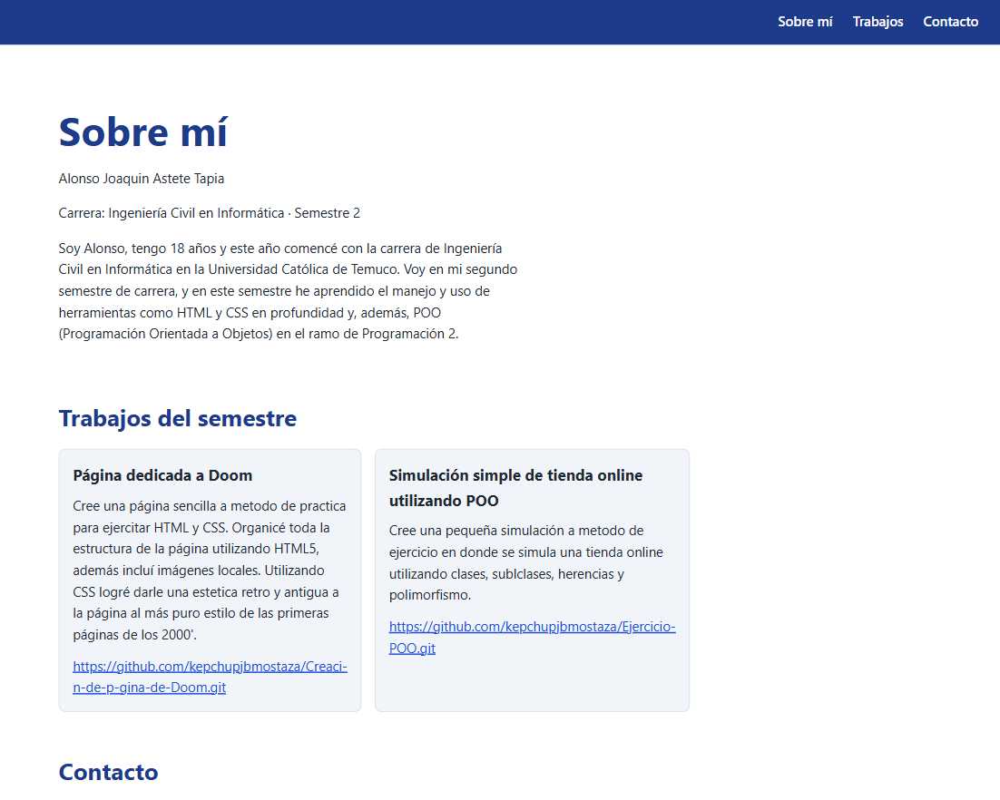
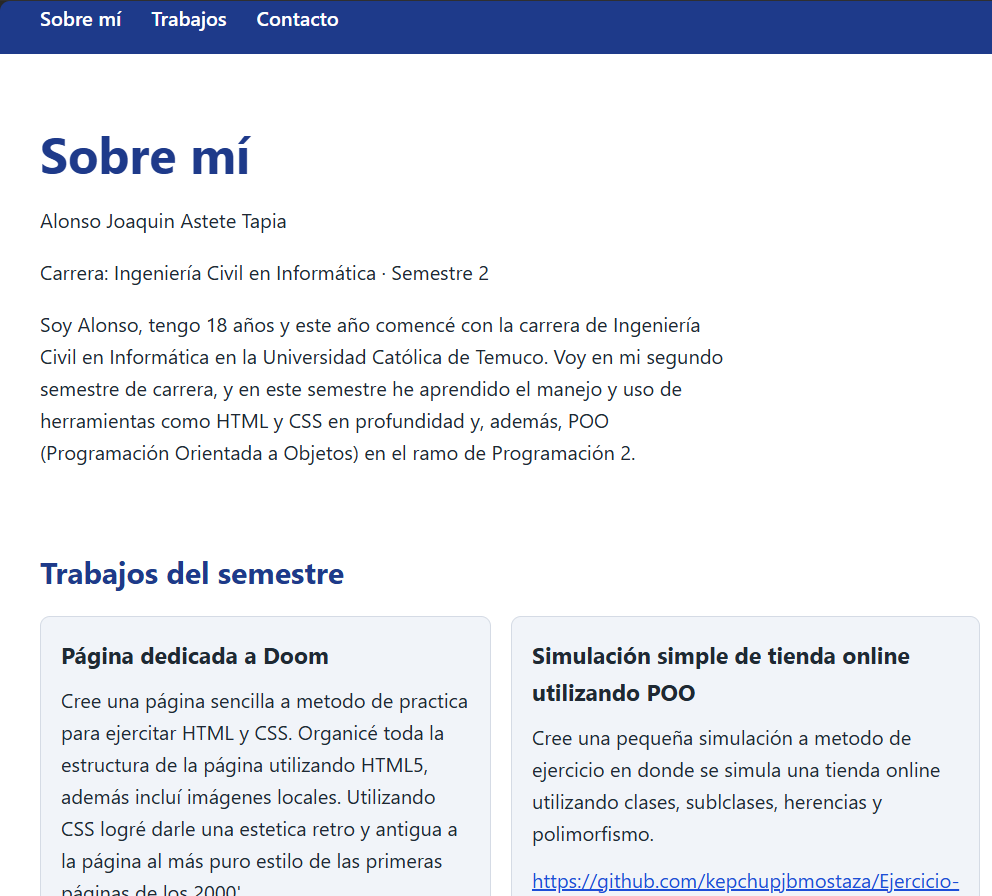
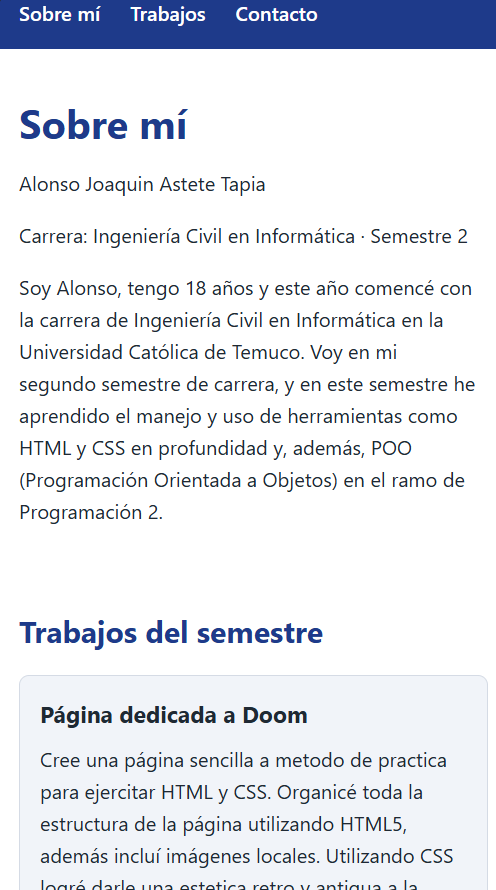

#Portafolio personal
Evaluación 2 - Desarrollo de Frontend (ICINF1107) - Ingeniería Civil en Informática, Universidad Católica de Temuco

## Descripción

Portafolio web personal, construido con HTML y CSS. Presenta una breve explicación de mi y lo que hago, algunos trabajos
que he realizado en este semestre a modo de demostración y una forma de contactarme. 

## Audiencia y propósito

La audiencia principal son los docentes evaluadores, facilitando información clave acerca de mi como: Quien soy,
evidencia de aprendizaje y como contactarme.

## Tecnologías Ocupadas

· HTML5
· CSS
· Github
· Visual Studio Code
· IA

## Estructura del proyecto

proyecto
├── css
│   └── style.css
├── img
│   ├── 1200.png
│   ├── 800.png
│   └── 400.png
├── index.html
└── README.md

## Como se abre?

1. Clonar o descargar el repositorio desde Github.
2. Abrir el index.html en cualquier navegador o con la extensión Live Servers de VS Code.

Repositorio: https://github.com/kepchupjbmostaza/Portafolio-Personal.git

## Decisiones de diseño

· Orden de contenido: Sobre mí va primero ya que es lo que el docente busca, los trabajos van después a modo de evidencia, y el
contacto al final.
· Estructura Semántica: Se hizo uso de "Header", "Nav", "Main", "Section", "Article" y "Footer" en lugar de div.
· 3 breakpoints: Se crearon 3 breakpoints diferentes para celular, tablet y pc.
· Jerarquía Visual: Tres niveles de títulos con diferentes tamaños, un único color de acento y tarjetas para los trabajos, con el objetivo de guiar la vista hacia lo que se busca.
· Organización del proyecto: Estilos e imágenes en carpetas para facilitar la mantención.

## Capturas

## Accesibilidad

· Contraste: Texto Oscuro sobre fondo blanco y texto blanco sobre fondo oscuro.
· Textos Alternativos: todas las imagenes llevan "alt" que describe lo que muestran
· Teclado: Todo es navegable con Tab 
· Jerarquía de encabezados: Solo tiene un "h1", seguido de "h2" y "h3" en orden.
· Landmarks y ARIA: "header", "nav" (con aria-label). "main" y "footer": las secciones usan aria-labelledby; el documento declara
"lang = es" al inicio del codigo.

## Dificultades

A la hora de hacer el proyecto se presentaron algunas dificultades con el manejo de las carpetas y breakpoints.

## Utilización de IA

Se hizo uso de Claude 

**Que hizo Claude**?

· Revisó el codigo en busca de errores.
· Ayudó con los 3 breakpoints con enfoque en mobile-first y con la generación del style de css.
· Ayudó con problemas en carpetas.

